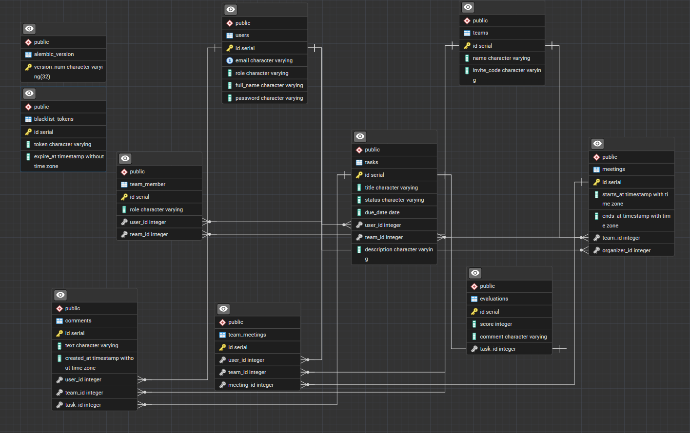

## Пользователи и Аутентификация

Модуль отвечает за безопасность, регистрацию и управление профилями. Авторизация в приложении построена на базе *
*JWT-токенов** с соблюдением стандартов OAuth2.

### Аутентификация (`/auth`)

* **Регистрация (`POST /register`)**: Создание нового аккаунта с автоматической валидацией уникальности email и
  безопасным хэшированием пароля.
* **Вход (`POST /login`)**: Эндпоинт, совместимый со спецификацией OAuth2 (`OAuth2PasswordRequestForm`). Валидирует
  учетные данные и возвращает `access_token`.
* **Выход (`POST /logout`)**: Реализован механизм принудительного отзыва токена. При логауте текущий JWT-токен заносится
  в таблицу `blacklist_tokens`, делая его недействительным для дальнейших запросов.

### Профиль пользователя (`/users`)

Все эндпоинты этого раздела защищены и требуют наличия валидного токена в заголовке `Authorization: Bearer <token>`.

* **Профиль (`GET /me`)**: Получение детальной информации о текущем авторизованном пользователе, включая данные о его
  участии в командах.
* **Обновление данных (`PATCH /update-profile`)**: Частичное обновление профиля.
* **Смена пароля (`POST /change-password`)**: Эндпоинт для изменения пароля с обязательным подтверждением текущего (
  старого) пароля.

## Управление командами

Модуль реализует бизнес-логику команд. В нем реализована ролевая модель управления (создатель, менеджер, участник) и
строгая проверка прав доступа на уровне эндпоинтов и сервисов.

### Создание и вступление

* **Создание команды (`POST /create_team/`)**: Доступно только пользователям с правами менеджера (через зависимость
  `get_current_manager`). Текущий пользователь автоматически становится создателем/главным менеджером новой группы.
* **Вступление по коду (`POST /{invite_code}/join/`)**: Присоединение к команде с помощью уникального пригласительного
  кода. Встроена защита от дублирования записей (нельзя вступить в одну команду дважды).

### Управление составом

* **Список участников (`GET /{team_id}/members/`)**: Возвращает полный список членов команды. Доступно только для
  пользователей, уже состоящих в данной группе.
* **Изменение роли (`PATCH /{team_id}/members/{user_id}/role/`)**: Позволяет управлять иерархией внутри команды -
  изменять роли других участников (выполняется с проверкой уровня прав).
* **Исключение участника (`DELETE /{team_id}/members/{user_id}/`)**: Принудительное удаление пользователя из команды
  менеджером.
* **Выход из команды (`DELETE /{team_id}/leave/`)**: Самостоятельный добровольный выход текущего пользователя из состава
  рабочей группы.

> **Валидация данных:**
> Для всех маршрутов, принимающих ID сущностей, настроена строгая валидация параметров пути:
`Path(le=2147483647, ge=1)`. Это защищает СУБД от ошибок переполнения типа Integer и предотвращает падение сервера с 500
> ошибкой при передаче некорректных, отрицательных или слишком больших значений.

## Задачами и Оценки

Модуль содержит ядро бизнес-логики взаимодействия пользователей внутри рабочих групп. Маршрутизация построена так,
что все операции с задачами происходят в строгой изоляции внутри конкретной команды.

### Работа с задачами

Все эндпоинты требуют подтверждения членства в команде.

* **Создание и Просмотр (`POST`, `GET /teams/{team_id}/tasks/`)**: Любой участник группы может ставить новые задачи и
  просматривать общий пул работ команды.
* **Редактирование (`PATCH .../tasks/{task_id}`)**: Безопасное частичное обновление полей задачи (поддерживается
  `exclude_unset=True`). Доступ к изменению имеет только **создатель задачи** или **менеджер команды**.
* **Удаление (`DELETE .../tasks/{task_id}`)**: Права на удаление также строго ограничены создателем и менеджерами.

### Комментарии

* **Добавление и Чтение (`POST`, `GET .../tasks/{task_id}/comments`)**: Встроенная система коммуникации. Любой участник
  команды может оставлять комментарии к конкретным задачам и просматривать историю обсуждения, что позволяет хранить
  контекст работы в одном месте.

### Система ревью (Evaluations)

* **Оценка работы (`POST .../tasks/{task_id}/evaluation`)**: Механизм приемки задач, защищенный двойной проверкой
  бизнес-логики:
    1. Выставлять итоговые оценки могут **только пользователи с ролью менеджера**.
    2. Оценку невозможно выставить до тех пор, пока задача не будет официально закрыта (статус должен быть строго
       `done`).

## Расписание и Встречи

Модуль для планирования командных мероприятий с защитой от пересечений в расписании и строгой валидацией времени. Все
даты и время обрабатываются с учетом часовых поясов (UTC).

### Управление встречами команды

Доступ к созданию, редактированию и удалению встреч имеют **только менеджеры команды**. Обычные участники могут только
просматривать расписание.

* **Создание встречи (`POST /teams/{team_id}/meetings/`)**:
  При планировании новой встречи под капотом происходит несколько уровней валидации:
    1. Проверка того, что все приглашенные участники (`member_ids`) действительно состоят в данной команде.
    2. Защита от создания событий в прошлом.
    3. Проверка логики времени (время начала должно быть строго раньше времени окончания).
    4. **Collision Detection**: Проверка базы данных на наличие уже запланированных встреч команды на этот временной
       слот.
* **Редактирование (`PATCH .../meetings/{meeting_id}/`)**: Позволяет изменить время проведения или состав участников.
  При сдвиге времени повторно отрабатывает алгоритм проверки на пересечение расписаний.
* **Просмотр и Удаление (`GET`, `DELETE`)**: Стандартные операции с проверкой прав доступа (чтение для всех участников,
  удаление - только для менеджеров).

### Глобальный календарь пользователя

* **Календарь (`GET /teams/calendar/`)**: Глобальный эндпоинт, который собирает расписание пользователя **со всех
  команд**, в которых он состоит. Принимает параметры запроса `from` и `to` (диапазон дат) и возвращает агрегированный
  список встреч с детализацией по командам, организаторам и участникам. Идеально подходит для рендеринга виджета
  календаря на фронтенде.

## Архитектура базы данных

В качестве базы данных используется **PostgreSQL**. Взаимодействие с БД реализовано через асинхронную **SQLAlchemy**, а
управление миграциями осуществляется с помощью **Alembic**.



### Основные сущности и структура

Схема данных спроектирована с учетом разделения зон ответственности:

* **Пользователи и Авторизация (`users`, `blacklist_tokens`)**
  Хранение учетных данных, ролей и хэшей паролей. Таблица `blacklist_tokens` используется для безопасного отзыва
  JWT-токенов при логауте.
* **Команды (`teams`, `team_member`)**
  Реализована связь «многие-ко-многим». Промежуточная таблица `team_member` фиксирует не только сам факт участия, но и
  внутреннюю роль пользователя в конкретной команде (например, `manager` или `member`). Вступление реализовано через
  `invite_code`.
* **Задачи (`tasks`, `evaluations`, `comments`)**
  Задачи жестко привязаны к командам и исполнителям. Для обратной связи предусмотрена система комментариев и отдельная
  таблица `evaluations` (связь 1-к-1 с задачами) для выставления финальных оценок.
* **Расписание и Встречи (`meetings`, `team_meetings`)**
  Встречи имеют четкие временные рамки (`starts_at`, `ends_at`) и привязку к организатору. Промежуточная таблица
  `team_meetings` позволяет приглашать на встречу выборочных участников команды.

**Оптимизация:**
Для ускорения сложных выборок и `JOIN`-запросов расставлены индексы на всех внешних ключах, а также на полях, часто
участвующих в фильтрации (даты встреч, статусы задач, токены).
___

## Установка и запуск проекта

### Шаг 1. Клонирование репозитория

Клонировать проект и перейти в папку с проектом:

```bash
git clone https://github.com/temashev/final-project
cd final-project
```

### Шаг 2. Настройка переменных окружения

Создать файл `.env` в корневом каталоге проекта. В качестве основы можно использовать шаблон `.env.example`:

```
DB_USER=db_user
DB_PASS=db_pass
DB_NAME=db_name
DB_PORT=db_port
DB_HOST=db_host

# База для тестов
TEST_DB_USER=test_db_user
TEST_DB_PASS=test_db_pass
TEST_DB_NAME=test_db_name
TEST_DB_PORT=test_db_port
TEST_DB_HOST=test_db_host

SECRET_KEY=secret_key
ACCESS_TOKEN_EXPIRE_MINUTES=30
```

### Шаг 3. Виртуальное окружение и зависимости

Создать и активировать виртуальное окружение, затем установить все необходимые библиотеки:

Для Windows:

```bash
python -m venv .venv
.venv\Scripts\activate
pip install -r requirements.txt
```

Для Linux / macOS:

```bash
python3 -m venv .venv
source .venv/bin/activate
pip install -r requirements.txt
```

### Шаг 4. Настройка базы данных и миграции

```bash
alembic upgrade head
```

### Шаг 5. Запуск сервера

```bash
uvicorn app.main:app --reload
```

## Документация API (Swagger UI)

FastAPI автоматически генерирует интерактивную документацию. После запуска сервера документация доступна по ссылке:

* Swagger UI: http://127.0.0.1:8000/docs
* ReDoc: http://127.0.0.1:8000/redoc

Прямо из Swagger UI можно зарегистрировать пользователя, выполнить логин (кнопка `Authorize` в правом верхнем углу) и
протестировать все эндпоинты проекта.

## Запуск тестов
Для прогона тестов и проверки покрытия кода (coverage):
```bash
pytest --cov=app --cov-report=term-missing
```